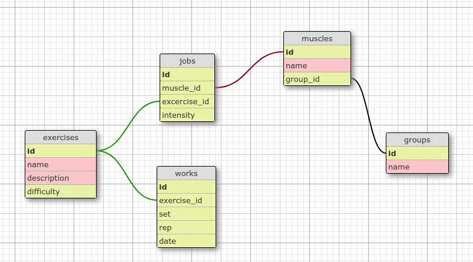

# Training Track

Aplicación para llevar el control de ejercicios realizados diariamente y su aporte a cada grupo muscular.

## Modelos

### Exercises
Es el directorio de ejercicios, push up, sentadillas, barras, etc. Para rastrear el esfuerzo de cada ejercicio con cada músculo este modelo está relacionado a **jobs** y a **work**, explicados más adelante.

### Jobs
Debió llamarse "efforts", pues está más relacionado al esfuerzo de cada ejercicio, pero se dejó el nombre de *Jobs* para denotar el *trabajo* logrado, es una tabla auxiliar para relacionar los ejercicios con los músculos, sus campos enlazan ambos modelos, y un campo representa la intensidad que tiene ese ejercicio en ése músculo.

### Works
Representa el ejercicio como tal realizado, repeticiones, sets, y la fecha en el que se realizó.

### Muscles
Enlazado a **Jobs** para relacionarse con **Exercises**, representa el músculo del cuerpo en el que se aplica el esfuerzo o trabajo logrado por el ejercicio realizado en un *work*.

### Groups
Es una tabla para agrupar los *músculos* por grupos musculares.

## Controladores
En una primera versión útil, la aplicación mostraría un dashboard para mostrar el trabajo realizado en cada grupo muscular (o cada músculo) con el fin de trazar un entrenamiento personalizado en función del músculo que se desee entrenar. Si se desea entrenar todos los músculos por igual puede usarse para aumentar el esfuerzo en ése músculo que tenga menor esfuerzo haciendo uno o varios ejercicios enfocados en el mismo.

## Prototipo
En construcción, disponible en [Figma](https://www.figma.com/file/tcxY34plnnlplSLzDGk5jp/TrainingTrack).

---

<small>Rails app generated with [lewagon/rails-templates](https://github.com/lewagon/rails-templates), created by the [Le Wagon coding bootcamp](https://www.lewagon.com) team.</small>
